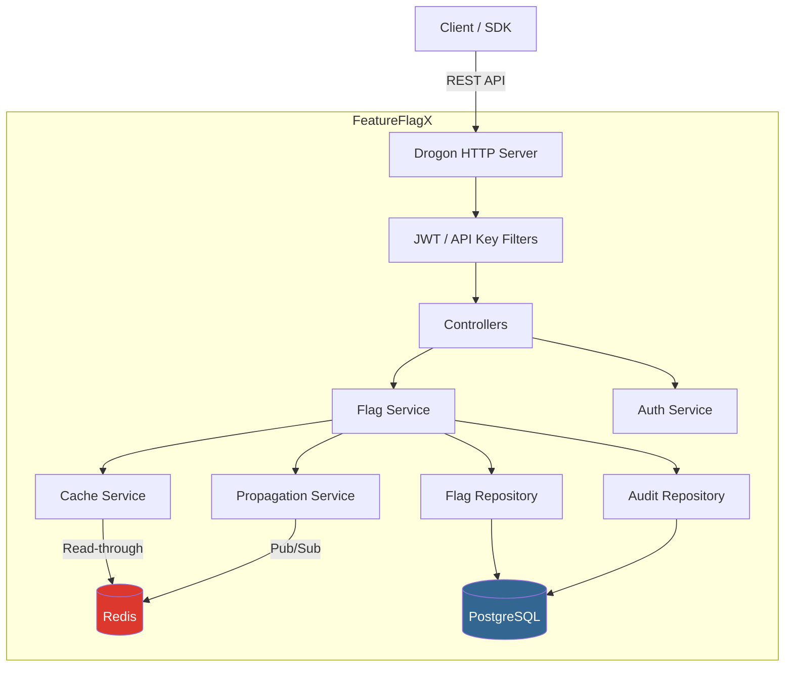

# FeatureFlagX

[](https://github.com/PreethamSanji/feature-flag-x/actions/workflows/ci.yml)
[](LICENSE)
[](https://isocpp.org/)
[](https://www.postgresql.org/)
[](https://redis.io/)

A self-hosted, distributed feature flag and configuration management service. Manage feature rollouts, kill switches, and A/B experiments at runtime via a REST API — no redeployments required.

## Architecture



## Features

- **Feature Flags** — Boolean, string, number, and JSON flag types
- **Targeting Rules** — Evaluate flags against user context with operators: `in`, `not_in`, `eq`, `neq`, `gt`, `lt`, `contains`, `percentage`
- **Percentage Rollouts** — Deterministic hashing for gradual feature rollouts
- **Environments** — Separate flag configurations per environment (dev, staging, production)
- **Caching** — Redis read-through cache with 60s TTL and instant Pub/Sub invalidation
- **Real-time Sync** — Redis Pub/Sub propagates flag changes across all service instances
- **JWT Authentication** — Secure API access with role-based access control
- **API Key Auth** — Lightweight authentication for SDK evaluation endpoints
- **RBAC** — Three-tier permission model: viewer, editor, admin
- **Audit Logging** — Full mutation history for compliance and debugging
- **ETag Support** — Conditional requests with `If-None-Match` / `ETag` headers
- **Versioned Flags** — Every mutation increments the version for staleness detection

## Quick Start

```bash
# Clone and start all services
git clone https://github.com/PreethamSanji/feature-flag-x.git
cd feature-flag-x
docker compose up --build

# Seed the database
docker exec -i ffx-postgres psql -U ffx -d featureflagx < scripts/seed.sql

# Login (default admin from seed)
TOKEN=$(curl -s http://localhost:8080/api/v1/auth/login \
  -H "Content-Type: application/json" \
  -d '{"email":"admin@featureflagx.io","password":"admin123"}' \
  | jq -r '.token')

# Create a flag
curl -s http://localhost:8080/api/v1/flags \
  -H "Authorization: Bearer $TOKEN" \
  -H "Content-Type: application/json" \
  -d '{
    "key": "ui.new_dashboard",
    "description": "Enable the redesigned dashboard",
    "flag_type": "boolean",
    "default_value": false,
    "enabled": true,
    "environment": "production",
    "rules": [{
      "attribute": "user_id",
      "operator": "in",
      "values": ["u_100", "u_200"],
      "rollout_percentage": 100,
      "value": true
    }]
  }' | jq

# Evaluate a flag (uses API key)
curl -s http://localhost:8080/api/v1/evaluate \
  -H "X-API-Key: ffx_ak_admin_0000000000000000000000000000000000000000" \
  -H "Content-Type: application/json" \
  -d '{
    "flag_key": "ui.new_dashboard",
    "context": {"user_id": "u_100"}
  }' | jq
```

**Expected evaluation response:**

```json
{
  "flag_key": "ui.new_dashboard",
  "value": true,
  "version": 1,
  "reason": "rule_match"
}
```

## API Reference

### Authentication

| Method | Path | Auth | Description |
|--------|------|------|-------------|
| `POST` | `/api/v1/auth/login` | None | Login, returns JWT |
| `POST` | `/api/v1/auth/register` | JWT + Admin | Create a new user |

### Feature Flags

| Method | Path | Auth | Role | Description |
|--------|------|------|------|-------------|
| `GET` | `/api/v1/flags` | JWT | viewer+ | List all flags |
| `GET` | `/api/v1/flags/:key` | JWT | viewer+ | Get flag by key |
| `POST` | `/api/v1/flags` | JWT | editor+ | Create a flag |
| `PUT` | `/api/v1/flags/:key` | JWT | editor+ | Update a flag |
| `DELETE` | `/api/v1/flags/:key` | JWT | admin | Delete a flag |
| `POST` | `/api/v1/flags/:key/toggle` | JWT | editor+ | Toggle enabled state |

### Evaluation

| Method | Path | Auth | Description |
|--------|------|------|-------------|
| `POST` | `/api/v1/evaluate` | API Key | Evaluate a single flag |
| `POST` | `/api/v1/evaluate/bulk` | API Key | Evaluate multiple flags |

### Audit

| Method | Path | Auth | Role | Description |
|--------|------|------|------|-------------|
| `GET` | `/api/v1/audit?flag_key=...&limit=50` | JWT | admin | View audit log |

## Targeting Rules

| Operator | Description | Example |
|----------|-------------|---------|
| `in` | Value is in the list | `user_id` in `["u_1", "u_2"]` |
| `not_in` | Value is not in the list | `country` not in `["CN", "RU"]` |
| `eq` | Exact match | `plan` equals `"pro"` |
| `neq` | Not equal | `status` not equals `"banned"` |
| `gt` | Greater than (numeric) | `age` > `18` |
| `lt` | Less than (numeric) | `score` < `50` |
| `contains` | Substring match | `email` contains `"@company.com"` |
| `percentage` | Deterministic rollout | 25% of users based on hash |

## Configuration

All settings are configured via environment variables:

| Variable | Default | Description |
|----------|---------|-------------|
| `FFX_DB_HOST` | `localhost` | PostgreSQL host |
| `FFX_DB_PORT` | `5432` | PostgreSQL port |
| `FFX_DB_NAME` | `featureflagx` | Database name |
| `FFX_DB_USER` | `ffx` | Database user |
| `FFX_DB_PASSWORD` | `ffx_secret` | Database password |
| `FFX_DB_POOL_SIZE` | `10` | Connection pool size |
| `FFX_REDIS_HOST` | `localhost` | Redis host |
| `FFX_REDIS_PORT` | `6379` | Redis port |
| `FFX_JWT_SECRET` | `change-me-in-production` | JWT signing secret |
| `FFX_JWT_EXPIRY` | `3600` | JWT token expiry (seconds) |
| `FFX_SERVER_PORT` | `8080` | HTTP server port |
| `FFX_SERVER_THREADS` | `4` | Worker thread count |

## Development

### Build from Source

```bash
# Prerequisites: CMake 3.22+, C++23 compiler, vcpkg

# Install dependencies
vcpkg install

# Build
mkdir build && cd build
cmake -DCMAKE_TOOLCHAIN_FILE=<vcpkg-root>/scripts/buildsystems/vcpkg.cmake ..
make -j$(nproc)

# Start Postgres and Redis
docker compose up -d postgres redis

# Run migrations
PGPASSWORD=ffx_secret psql -h localhost -U ffx -d featureflagx -f sql/migrations/001_init.sql
PGPASSWORD=ffx_secret psql -h localhost -U ffx -d featureflagx -f sql/migrations/002_audit_log.sql

# Run the server
./featureflagx

# Run tests
ctest --output-on-failure
```

## Project Structure

```
featureflagx/
├── CMakeLists.txt              # Build configuration
├── vcpkg.json                  # Dependency manifest
├── docker-compose.yml          # PostgreSQL + Redis + App
├── Dockerfile                  # Multi-stage build
├── sql/migrations/
│   ├── 001_init.sql            # Flags and users tables
│   └── 002_audit_log.sql       # Audit log table
├── scripts/seed.sql            # Sample data
├── src/
│   ├── main.cpp                # Entry point and Drogon setup
│   ├── config/                 # Environment config loader
│   ├── models/                 # Flag, User, AuditEntry
│   ├── repositories/           # PostgreSQL access (connection pool)
│   ├── services/               # Business logic and caching
│   ├── controllers/            # REST API handlers
│   ├── middleware/              # JWT, API Key, RBAC filters
│   └── utils/                  # JSON helpers, time utils
├── tests/                      # GoogleTest unit tests
└── .github/workflows/ci.yml   # GitHub Actions CI
```

## License

[MIT](LICENSE)
